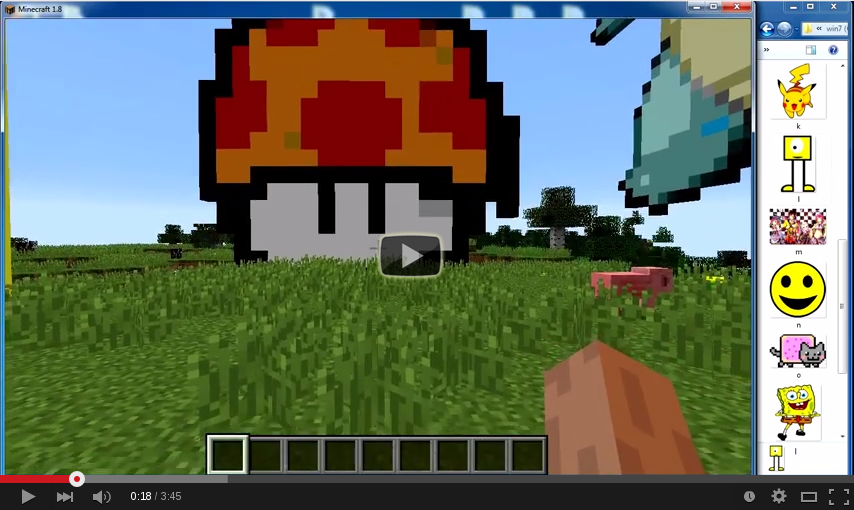

# ImageCraft

This mod can load an image into the Minecraft world, and you also get 216 colored blocks under `ImageCraft` creative tab.
This is beta version.

## Contents

- [Installation](#installation)
- [Usage](#usage)
- [Build](#build)
- [Usage](#usage)
- [Screenshot](#screenshot)

## Installation

1. Install [Minecraft Forge](http://files.minecraftforge.net/) 1.8
2. Download the [ImageCraft-1.8-1.01.jar](./ImageCraft-1.8-1.01.jar?raw=true) file, and copy it to `.minecraft/mods`

## Usage

To build an image you can use the `/image` command.

Required arguments:

| Name             | Value       | Description                                                                |
|------------------|-------------|----------------------------------------------------------------------------|
| path             | path or url | The path to the image. You can use JPEG, PNG, BMP, and GIF image format.   |
| w                | a number    | The width attribute specifies the width of the image, in blocks. If you don't specify this argument, it will calculated from h argument.           |
| h                | a number    | The height attribute specifies the height of the image, in blocks. If you don't specify this argument, it will calculated from w argument.        |

Example: `/image path C:/some/folder/example.png w 20 h 20`

Optional arguments:

| Name         | Value                    | Description                                                        |
| -------------|--------------------------|--------------------------------------------------------------------|
| left         | no value                 | Build the image from the specified position to the left. This is the default behavior.  |
| right        | no value                 | Build the image from the specified position to the right. |
| up           | no value                 | Build the image upward. This is the default behavior. |
| forward      | no value                 | Build the image forward. |
| pos          | three numbers            | The position of the loaded image. If you don't specify the pos argument, then the pos will equal to the block in front of you.  |
| clear        | no value                 | Clear(set the blocks to air) the image instead of building it.      |
| scale        | smooth, nearest, bicubic | Image scaling type. It depends on the picture which one is better. The default value is nearest. |
| distance     | cie76, cie94, ciede2000  | Color distance options. It depends on the picture which one is better. The default value is cie94.  |
| alpha        | a number                 | If the number is 0 or negative then you turn off the transparency. If the number bigger than 255 then the whole picture will be transparent(equal to clear argument). The default value is 10.  |
| undo         | no value                 | It is a special undo subcommand, what you can use to replace the blocks back to the original states. It is only working for the last five `/image` commands, or until you log out. If you use this argument, you can't use any other argument.  |

Example: `/image path C:/some/folder/example.png w 20 left up pos -12 67 -34 alpha 20 scale smooth distance cie76`
Example: `/image undo`

## Build

Use gradlew.

```
./gradlew setupDecompWorkspace --refresh-dependencies
./gradlew eclipse
```

## Screenshot
Video:
<a href="https://www.youtube.com/watch?v=hOr_JgSSZo8" target="_blank"></a>
---------------------------


